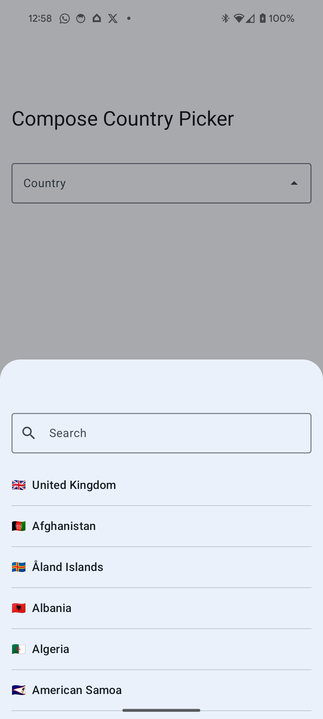
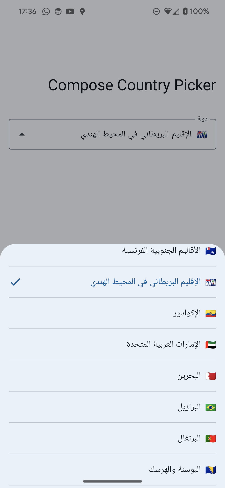

<div style="text=align:center">
<a href="https://github.com/leisurepassgroup/apps-gocity-app-android">
<picture>
  <source media="(prefers-color-scheme: dark)" srcset="docs/images/android-banner-dark.png">
  
</picture>
</a>
</div>

# Jetpack Compose Country Code Picker [](https://central.sonatype.com/artifact/com.gocity.countrypicker/countrypicker/1.4.0)


[](https://kotlinlang.org/)
[](https://developer.android.com/jetpack/compose/)

## A very simple Country Code Picker

Includes a `CountryPicker` and a `PhoneNumberPicker`, which pairs a country's flag and calling code
with a phone number field that formats and validates the number for that country.

The library uses emojis and the standard Java country translations so you get a rich looking UI
without needing any translations. The only resource strings it uses are labels such as "Country"
and "Phone number" and the phone number error messages, so if you want to display something else
or some of your languages aren't supported simply add the missing translations or pass your own.

## Screenshots

<div class="row">
   
   
</div>

## Download

Country Code Picker is available on mavenCentral().

Toml configuration

```toml
[versions]
countrypicker = '1.4.0'

[libraries]
countrypicker = { group = "com.gocity.countrypicker", name = "countrypicker", version.ref = "countrypicker" }
```

```groovy
implementation("libs.countrypicker")
```

Just gradle

```groovy
implementation("com.gocity.countrypicker:countrypicker:1.4.0")
```

## Usage

See [MainActivity in the sample app](example/src/main/kotlin/com/gocity/countrypicker/example/MainActivity.kt)
for an example.

``` kotlin
var country: Country? by rememberSaveable { mutableStateOf<Country?>(null) }
CountryPicker(currentCountry = country) {
    country = it
}
```

Pass a `shape` to match your own style, e.g.
`CountryPicker(currentCountry = country, shape = CircleShape)`.

### Phone number picker

`PhoneNumberPicker` shows the country's flag and calling code next to a field for the number.

- The number is formatted and validated using the selected country's rules, e.g. `(212) 555-1234`
  in the US and `7400 123456` in the UK.
- The country follows what is typed. Countries that share a calling code are told apart by the
  digits, so typing `416` after +1 selects Canada and `212` selects the United States.
- Typing, pasting or autofilling an international number such as `+44 7400 123456` sets the
  country from it, and a leading national prefix such as the UK's `0` is removed.
- Errors are shown once the user has finished typing, or when you call `validate()`.

``` kotlin
val phoneNumber = rememberPhoneNumberState()
PhoneNumberPicker(phoneNumber)

Button(onClick = { if (phoneNumber.validate()) submit(phoneNumber.e164) }) {
    Text("Submit")
}
```

To match your own style, pass a `shape` (e.g. `CircleShape` for fully rounded), `colors` and
`textStyle`, which apply to both the country button and the number field. Use `supportingText` to
show your own message for each state; the field turns to its error colors when `isError` is true.

``` kotlin
PhoneNumberPicker(
    phoneNumber,
    shape = CircleShape,
    supportingText = { validity, isError ->
        when {
            isError -> Text(PhoneNumberPickerDefaults.errorMessage(validity))
            validity == PhoneNumberValidity.Valid -> Text("Looks good")
            else -> Text("We'll only use this to contact you about your booking")
        }
    },
)
```

`rememberPhoneNumberState` defaults to the user's own country. Pass `initialCountry`,
`initialNumber` (national or international, e.g. `"+447400123456"`) or `countries` to limit the
list. Formatting and validation use Google's
[libphonenumber](https://github.com/google/libphonenumber).
