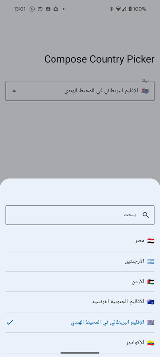

<div style="text=align:center">
<a href="https://github.com/leisurepassgroup/apps-gocity-app-android">
<picture>
  <source media="(prefers-color-scheme: dark)" srcset="docs/images/android-banner-dark.png">
  
</picture>
</a>
</div>

# Jetpack Compose Country Code Picker [](https://central.sonatype.com/artifact/com.gocity.countrypicker/countrypicker/1.0.0)


[](https://kotlinlang.org/)
[](https://developer.android.com/jetpack/compose/)

## A very simple Country Code Picker

The library uses emojis and the standard Java country translations so you get a rich looking UI
without needing any translations. The only resource string it uses is the word "Country", so if you
want to display something else or some of your languages aren't supported
simply add the missing translations or create your own label.

## Screenshots

<div class="row">
   
   
</div>

## Download

Country Code Picker is available on mavenCentral().

Toml configuration

```toml
[versions]
countrypicker = '1.2.0'

[libraries]
countrypicker = { group = "com.gocity.countrypicker", name = "countrypicker", version.ref = "countrypicker" }
```

```groovy
implementation("libs.countrypicker")
```

Just gradle

```groovy
implementation("com.gocity.countrypicker:countrypicker:1.2.0")
```

## Usage

See [MainActivity in the sample app](example/src/main/kotlin/com/gocity/countrypicker/example/MainActivity.kt)
for an example.

``` kotlin
var country: Country? by rememberSaveable { mutableStateOf<Country?>(null) }
CountryPicker(currentCountry = country) {
    country = it
}
```
